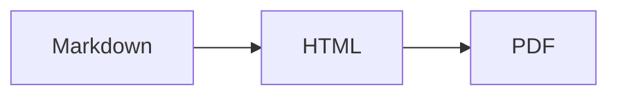

# md-mermaid-pdf

Render a Markdown file containing Mermaid diagrams into a GitHub-like PDF.

The CLI uses `markdown-it` for GitHub-flavoured Markdown, `github-markdown-css` for familiar styling, Mermaid for diagrams, Highlight.js for code blocks, and Playwright/Chromium to print the final page to PDF.

## Requirements

- Node.js 20 or newer
- Playwright Chromium, installed by the setup command below

## Install

```bash
npm install md-mermaid-pdf
npx playwright install chromium
```

For local development:

```bash
npm install
npx playwright install chromium
npm link
```

Then run:

```bash
md-mermaid-pdf docs/architecture.md docs/architecture.pdf
```

You can also run without linking:

```bash
node ./src/cli.js docs/architecture.md docs/architecture.pdf
```

## Programmatic API

```js
import { renderMarkdownToPdf } from "md-mermaid-pdf";

await renderMarkdownToPdf("docs/architecture.md", "docs/architecture.pdf", {
  toc: true,
  theme: "forest",
});
```

## Usage

```bash
md-mermaid-pdf <input.md> [output.pdf] [options]
```

If `output.pdf` is omitted, the CLI writes a PDF next to the input file.

### Options

```text
--title <title>        Document title, defaults to the Markdown file basename
--author <author>      PDF author metadata, defaults to md-mermaid-pdf
--theme <theme>        Mermaid theme, defaults to default
--page-size <size>     PDF page size, defaults to A4
--margin <margin>      PDF margin, defaults to 18mm
--toc                  Add a generated table of contents
--no-background        Do not print CSS backgrounds
--debug-html <path>    Write the intermediate HTML to inspect rendering
--verbose              Print timing for each render phase
--quiet                Suppress all output
-v, --version          Print version number
```

## Mermaid diagrams

Use standard fenced code blocks:

````markdown

````

If Mermaid fails to parse a diagram, the command exits non-zero and reports the Markdown file path.

## Smoke test

```bash
npm test
```

The smoke test renders `samples/example.md` and verifies the output is a valid PDF with correct metadata. It also tests additional CLI flags and verifies that malformed Mermaid diagrams produce a non-zero exit.

## Notes

- This aims to look close to GitHub Markdown, not pixel-identical to github.com.
- Diagrams are rendered in Chromium before printing, so the PDF output reflects real browser layout.
- For CI, install browser dependencies according to your environment if Playwright asks for them.
