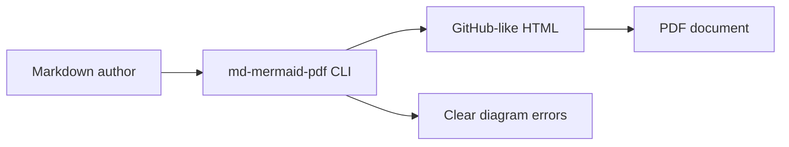
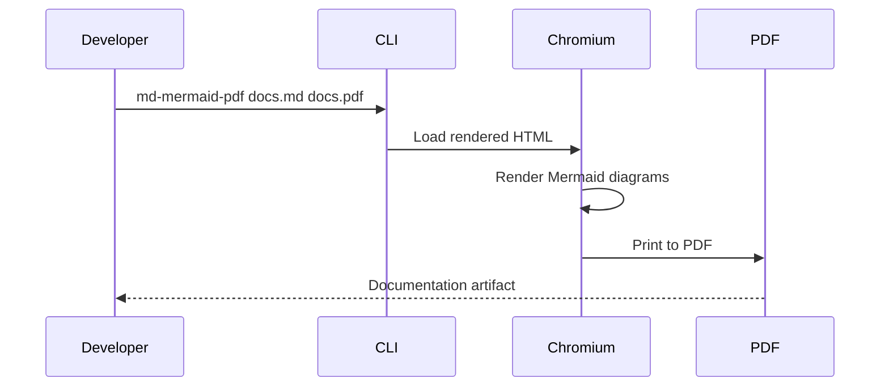

# Example Documentation

This file demonstrates GitHub-flavoured Markdown rendering with tables, task lists, code blocks, and Mermaid diagrams.

## Architecture



## Deployment sequence



## Markdown features

- [x] Tables
- [x] Task lists
- [x] Syntax highlighting
- [x] Mermaid diagrams

| Feature | Status | Notes |
| --- | --- | --- |
| Mermaid | Supported | Fenced `mermaid` blocks become diagrams |
| Code | Supported | Uses Highlight.js GitHub theme |
| PDF | Supported | Printed through Chromium |

```python
from pathlib import Path

def docs_changed(path: Path) -> bool:
    return path.suffix == ".md"
```

> The styling intentionally follows GitHub Markdown conventions rather than a bespoke report design.
